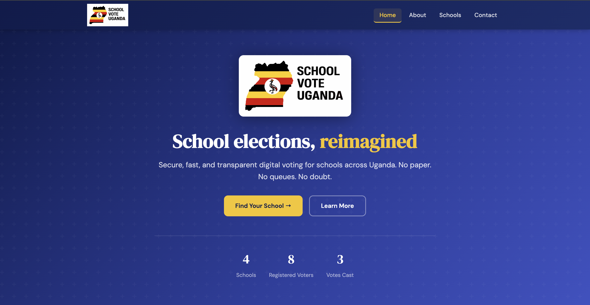
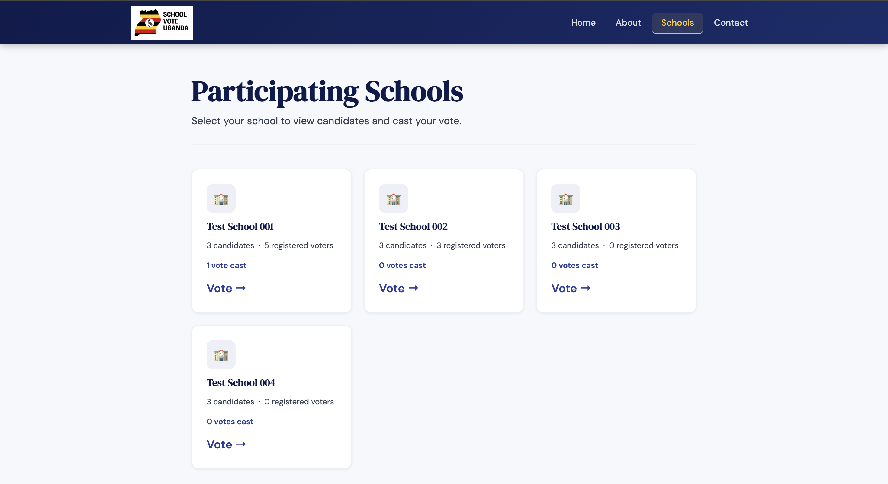
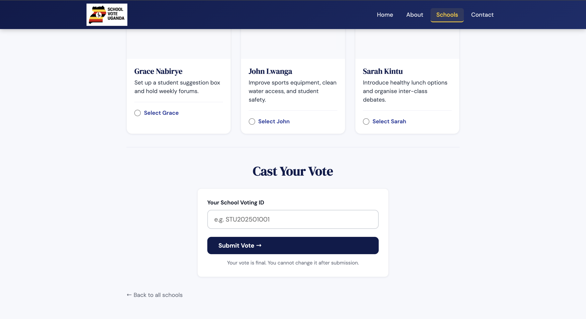
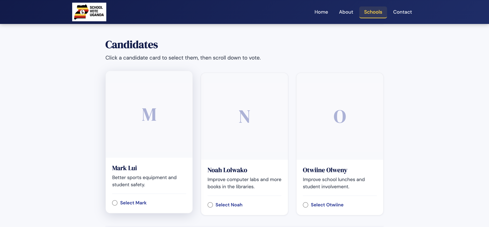
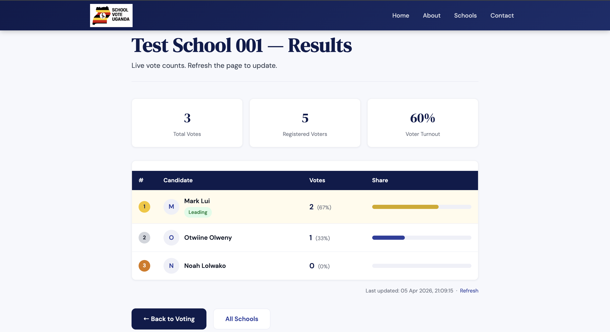

# School Vote Uganda [WORK IN PROGRESS]

> Secure, transparent, and fast digital elections for secondary schools across Uganda.

---

## What is School Vote Uganda?

School Vote Uganda is a web-based voting platform built specifically for Ugandan secondary schools. It replaces slow, error-prone paper ballots with a secure digital system that any student can use from their phone.

Each school gets its own dedicated voting space. Students vote using a unique ID issued by their school. Results update live the moment polls close — no manual counting, no disputes, no lost ballots.

---

## Screenshots

| Home | Schools | Voting |
|------|---------|--------|
|  |  |  |

| Candidate Selection | Results |
|---------------------|---------|
|  |  |

---

## Features

- **One vote per student** — each voting ID can only be used once, enforced at the database level
- **School-scoped** — each school has its own candidates, voters, and results completely isolated from others
- **Live results** — vote counts update in real time for authorised staff
- **Mobile-friendly** — works on any phone, optimised for Ugandan network speeds
- **Secure** — prepared SQL statements, session handling, and server-side validation on every vote
- **No paper** — no queues, no manual counting, no disputes

---

## How It Works

1. A school contacts us to get onboarded
2. We set up a dedicated voting space with their candidates and student voting IDs
3. On election day, students visit the site, find their school, select a candidate, and enter their voting ID
4. The vote is recorded instantly and securely in the database
5. When polls close, authorised staff view live results on the results page

---

## Tech Stack

| Layer | Technology |
|-------|-----------|
| Frontend | HTML5, CSS3, JavaScript |
| Backend | PHP |
| Database | MySQL |
| Server | Apache (LAMP stack) |

---

## For Schools

Want to run your next student election on School Vote Uganda?

We handle the full setup — no technical knowledge required from your school.

**Contact us:**

- 📧 Email: [REDACTED]
- 📱 WhatsApp: +256 [REDACTED]
- 🌐 Live demo: [REDACTED]

---

## Built By

School Vote Uganda was created by **Otwiine Olweny** ([@Otwiine](https://github.com/Otwiine)) and **Mark Lui** ([@Trojannetwork](https://github.com/Trojannetwork)) as a student developer initiative to modernise school elections across Uganda.

---

## License

All rights reserved. The source code is not open for reuse, redistribution, or rebranding without written consent from the authors. This repository exists for portfolio and transparency purposes only.
